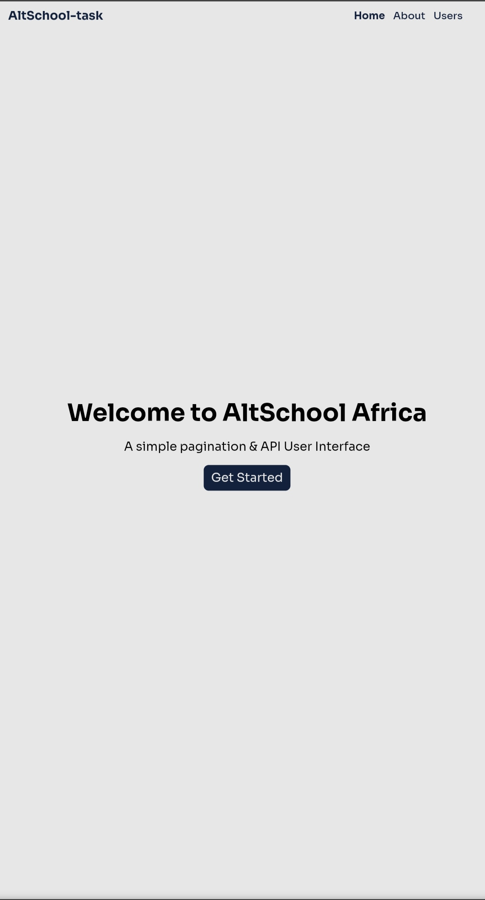
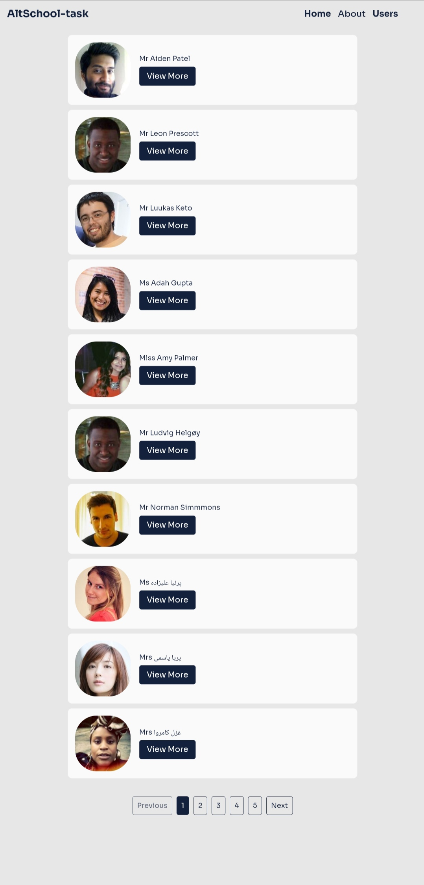

## [AltSchool Africa]() School of engineering Second semester assignment

[Click here to view the live site](https://random-users-api-altschool-assignment.vercel.app/)

### Screenshot

### Technologies and tools used

- CSS3
- Remix icons
- [React JS](https://reactjs.org/)

### Developer Info

- [Website](https://codexjay.vercel.app)
- [Twitter](https://twitter.com/Chibuike035)
- [LinkedIn](https://www.linkedin.com/in/chibuike-ukandu-8385401b0/)
